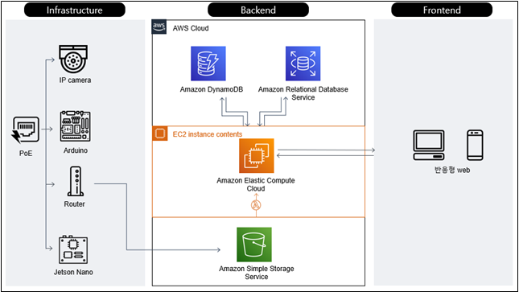

# Linked Park

## Info
- 엣지 컴퓨팅 기반 클라우드 거주자 주차관리 시스템<br>(자세한 정보를 확인할 경우 [Detail](./assets/readme.md) 링크를 클릭해주세요)

---

## Demo
[](https://www.youtube.com/watch?v=PAR3cGi0zfg)

---


## Architecture


---

## Environment & Software skill
|구분|항목|
|---|---|
|OS|Ubuntu 18.04 (Kernel : 5.4.0)|
|Framework|- NodeJS 14.16.1 (ExpressJS 4.17.1)<br>- Flask 2.0.1<br>- Tensorflow 2.3.0
|Language|- JavaScript<br>- Python<br>- C++<br>- HTML/CSS|
|Database|MySQL, DynamoDB|
|Web Server|Nginx|
|Cloud|AWS(EC2, S3, RDS, DynamoDB, Lambda, SNS)

---

## Repository Architecture
```bash
    ├── assets
    ├── data-mining
    ├── docs
    ├── flask
    ├── hardware
    └── web
```
|디렉토리|설명|
|------|-----|
|assets|readme 작성을 위한 자료|
|data-mining|데이터마이닝 관련 코드|
|docs|제출 서류 관련 코드|
|flask|플라스크 관련 코드|
|hardware|젯슨나노 및 아두이노 관련 코드|
|web|노드 관련 코드|
